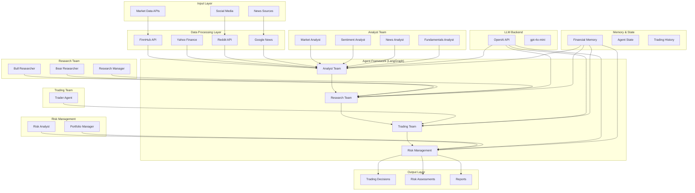

# TradingAgents: Master Architecture & Development Plan

## 📋 Project Overview
**TradingAgents** is a multi-agent LLM framework for financial trading that simulates real-world trading firms through specialized AI agents collaborating on market analysis and trading decisions.

**Current Status**: ✅ Setup Complete | 🧪 Ready for Architecture Testing  
**Last Updated**: 2024-06-09  
**Version**: v0.1.1-alpha

---

## 🏗️ Current Architecture

### 🔧 Technical Stack
- **Framework**: LangGraph for agent orchestration
- **LLMs**: OpenAI GPT-4o-mini (testing), planned DeepSeek (production)
- **Data Sources**: FinnHub, Yahoo Finance, Reddit, Google News
- **Memory**: Custom FinancialSituationMemory
- **Environment**: Python 3.9+, .env configuration

---

## 📊 Current State Assessment

### ✅ Completed Components
- [x] **Environment Setup**: API keys, dependencies, .env configuration
- [x] **Core Agent Framework**: LangGraph-based multi-agent system
- [x] **Data Integration**: FinnHub, Yahoo Finance, Reddit APIs
- [x] **Basic Agent Types**: Market, Sentiment, News, Fundamentals analysts
- [x] **Memory System**: Agent memory for learning from past decisions
- [x] **CLI Interface**: Interactive command-line interface
- [x] **Configuration Management**: Fixed hardcoded paths, optimized for testing
- [x] **Secure API Management**: .env file support with automatic loading
- [x] **User-Friendly Interface**: Improved main.py with clear error messages
- [x] **Development Workflow**: Git setup with fork tracking and proper remotes

### 🔄 In Progress
- [ ] **OpenAI API Access**: Resolving quota/billing setup (blocked)
- [ ] **Architecture Testing**: Validating agent interactions and decision flow
- [ ] **Cost Optimization**: Measuring and optimizing token usage

### ❌ Pending
- [ ] **Historical Backtesting**: Testing against historical market data
- [ ] **Performance Metrics**: Quantitative evaluation of trading decisions
- [ ] **Local Model Integration**: DeepSeek model deployment
- [ ] **Scalability Testing**: Multi-asset, multi-timeframe analysis
- [ ] **Production Infrastructure**: Raspberry Pi cluster setup

---

## 📝 Changelog

### v0.1.1-alpha (2024-06-09)
- **Added**: Automatic .env file loading with tradingagents.env_loader
- **Added**: Comprehensive architecture planning document (ARCHITECTURE_PLAN.md)
- **Added**: python-dotenv dependency for secure API key management
- **Fixed**: Hardcoded paths in default_config.py (removed /Users/yluo/ references)
- **Fixed**: Model configuration inconsistencies (o4-mini → gpt-4o-mini)
- **Improved**: main.py with user-friendly CLI and error handling
- **Improved**: Git workflow setup with proper fork tracking
- **Changed**: Default configuration optimized for cost-efficient testing
- **Security**: Added .env to .gitignore for API key protection

### v0.1.0-alpha (2024-06-09)
- **Added**: Initial project setup and environment configuration
- **Added**: LangGraph-based agent framework
- **Added**: Multi-agent analyst team (Market, Sentiment, News, Fundamentals)
- **Added**: Research team with Bull/Bear researchers
- **Added**: Trading and Risk Management agents
- **Added**: CLI interface for interactive testing

---

## 🧪 Phase 1: Architecture Testing & Validation

### Immediate Next Steps (Week 1-2)

1. **OpenAI API Resolution**
   - [ ] Add payment method to OpenAI account
   - [ ] Verify API quota and rate limits
   - [ ] Test minimal API calls for functionality

2. **Agent Flow Testing**
   - [ ] Test single agent execution (Market Analyst)
   - [ ] Test agent-to-agent communication
   - [ ] Validate decision propagation through the pipeline
   - [ ] Test memory persistence between runs

3. **Data Pipeline Validation**
   - [ ] Test offline data sources (cached financial data)
   - [ ] Validate data format consistency
   - [ ] Test error handling for missing data
   - [ ] Verify date range handling

4. **Cost Optimization Testing**
   - [ ] Measure token usage per agent
   - [ ] Optimize prompt efficiency
   - [ ] Test reduced debate rounds (current: 1)
   - [ ] Implement request batching where possible

### Testing Scenarios (Week 2-3)

1. **Single Stock Analysis**
   - [ ] Test NVDA analysis (current test case)
   - [ ] Test AAPL analysis for comparison
   - [ ] Test volatile stock (e.g., meme stock)
   - [ ] Test stable stock (e.g., utility)

2. **Market Condition Testing**
   - [ ] Bull market scenario
   - [ ] Bear market scenario
   - [ ] Sideways market scenario
   - [ ] High volatility events

3. **Decision Quality Assessment**
   - [ ] Track decision consistency
   - [ ] Measure reasoning quality
   - [ ] Test risk assessment accuracy
   - [ ] Validate portfolio management logic

---

## 🚀 Major Project Phases

### Phase 2: Local Model Integration (Month 1-2)

**Objective**: Replace OpenAI API with local DeepSeek models

#### 2.1 Local Model Setup
- [ ] **Research DeepSeek Model Variants**
  - Evaluate DeepSeek-R1, DeepSeek-V3 for financial tasks
  - Compare model sizes vs. performance trade-offs
  - Test quantization options for Raspberry Pi deployment

- [ ] **Local Inference Setup**
  - Install and configure Ollama or similar framework
  - Test model performance on development machine
  - Optimize inference parameters for speed/quality balance

- [ ] **API Compatibility Layer**
  - Create OpenAI-compatible API wrapper
  - Implement model switching configuration
  - Test seamless transition between local/remote models

#### 2.2 Raspberry Pi Cluster Architecture
- [ ] **Hardware Planning**
  - Calculate compute requirements for multi-agent system
  - Plan Raspberry Pi cluster configuration
  - Design power, cooling, and networking setup

- [ ] **Distributed Processing**
  - Design agent-to-Pi assignment strategy
  - Implement load balancing for inference requests
  - Create failover mechanisms for hardware failures

### Phase 3: MCP Server Integration (Month 2-3)

**Objective**: Implement Model Context Protocol for enhanced capabilities

#### 3.1 MCP Server Setup
- [ ] **Server Architecture Design**
  - Design MCP server for financial data access
  - Plan secure API endpoints for agent communication
  - Implement authentication and rate limiting

- [ ] **Financial Data MCP Tools**
  - Real-time market data feeds
  - Economic calendar integration
  - News sentiment analysis tools
  - Technical indicator calculators

- [ ] **Agent-MCP Integration**
  - Modify agents to use MCP tools
  - Implement tool discovery and capability negotiation
  - Add error handling for MCP communication

#### 3.2 Enhanced Capabilities
- [ ] **Advanced Data Sources**
  - SEC filing analysis
  - Earnings call transcripts
  - Insider trading data
  - Options flow data

- [ ] **Real-time Processing**
  - Streaming market data integration
  - Event-driven analysis triggers
  - Real-time risk monitoring

### Phase 4: Agent Specialization & Expansion (Month 3-4)

**Objective**: Create more specialized and sophisticated agents

#### 4.1 Specialized Analyst Agents
- [ ] **Technical Analysis Specialists**
  - Chart pattern recognition agent
  - Options flow analysis agent
  - Momentum/trend analysis agent
  - Support/resistance level agent

- [ ] **Fundamental Analysis Specialists**
  - Earnings analysis agent
  - Sector rotation agent
  - Economic indicator agent
  - Company comparison agent

- [ ] **Alternative Data Agents**
  - Satellite imagery analysis (retail foot traffic)
  - Social media sentiment (beyond Reddit)
  - Patent filing analysis
  - Supply chain analysis

#### 4.2 Advanced Trading Agents
- [ ] **Strategy Specialists**
  - Pairs trading agent
  - Arbitrage opportunity agent
  - Options strategy agent
  - Swing trading agent

- [ ] **Risk Management Specialists**
  - VaR calculation agent
  - Correlation analysis agent
  - Portfolio optimization agent
  - Black swan detection agent

### Phase 5: Historical Backtesting & Validation (Month 4-5)

**Objective**: Comprehensive testing against historical market data

#### 5.1 Backtesting Infrastructure
- [ ] **Data Pipeline**
  - Historical data ingestion (10+ years)
  - Data quality validation and cleaning
  - Event timeline reconstruction
  - News/sentiment historical matching

- [ ] **Simulation Engine**
  - Multi-timeframe simulation capability
  - Transaction cost modeling
  - Slippage and market impact simulation
  - Portfolio rebalancing logic

#### 5.2 Performance Analysis
- [ ] **Quantitative Metrics**
  - Sharpe ratio calculation
  - Maximum drawdown analysis
  - Win/loss ratio tracking
  - Risk-adjusted returns

- [ ] **Comparative Analysis**
  - Benchmark comparison (S&P 500, etc.)
  - Strategy performance across market regimes
  - Agent contribution analysis
  - Decision quality metrics

### Phase 6: Production Deployment (Month 5-6)

**Objective**: Deploy robust, scalable production system

#### 6.1 Infrastructure Scaling
- [ ] **Multi-Asset Support**
  - Stocks, ETFs, options, futures
  - Multiple market coverage (US, EU, Asia)
  - Currency and commodity analysis
  - Crypto market integration

- [ ] **High Availability Setup**
  - Redundant system architecture
  - Automatic failover mechanisms
  - Data backup and recovery
  - Monitoring and alerting systems

#### 6.2 Real-World Integration
- [ ] **Broker Integration**
  - Paper trading implementation
  - Real money trading (small scale)
  - Order management system
  - Trade execution optimization

- [ ] **Regulatory Compliance**
  - Trading regulations adherence
  - Risk management requirements
  - Audit trail implementation
  - Compliance monitoring

---

## 🎯 Success Metrics

### Testing Phase Metrics
- **System Stability**: >95% uptime during testing
- **Decision Consistency**: <10% variance in similar scenarios
- **Cost Efficiency**: <$0.10 per analysis cycle
- **Response Time**: <2 minutes for complete analysis

### Production Phase Metrics
- **Return Performance**: Target 15%+ annual return
- **Risk Management**: Maximum 10% drawdown
- **Sharpe Ratio**: Target >1.5
- **Win Rate**: Target >55% profitable trades

---

## 🔧 Development Workflow

### Testing Protocol
1. **Feature Branch Development**: All new features in separate branches
2. **Unit Testing**: Each agent component tested individually
3. **Integration Testing**: Full pipeline testing before merge
4. **Performance Testing**: Token usage and response time monitoring

### Documentation Standards
- **Code Documentation**: Inline comments for all agent logic
- **API Documentation**: Complete endpoint documentation
- **User Guides**: Setup and usage instructions
- **Architecture Updates**: This document updated with each major change

---

## 🚨 Risk Management

### Technical Risks
- **Model Reliability**: Implement multiple model fallbacks
- **Data Quality**: Comprehensive data validation
- **System Failures**: Redundant infrastructure planning
- **Security**: Secure API key and data handling

### Financial Risks
- **Backtesting Limitations**: Over-optimization awareness
- **Market Regime Changes**: Adaptive strategy implementation
- **Regulatory Changes**: Compliance monitoring
- **Capital Protection**: Strict risk limits and stop-losses

---

## 📞 Next Actions Summary

### This Week (High Priority)
1. 🔴 **Resolve OpenAI API access** - Add payment method to unlock quota
2. 🟡 **Initial architecture validation** - Test single agent execution
3. 🟡 **Cost monitoring setup** - Measure token usage per analysis
4. 🟢 **Git workflow** - ✅ Complete: Fork setup and initial commit

### Completed This Week ✅
- ✅ **Fixed configuration paths** - Removed hardcoded user directories
- ✅ **Improved main.py interface** - User-friendly CLI with error handling  
- ✅ **Secure API setup** - .env file with automatic loading
- ✅ **Architecture planning** - Comprehensive 6-month roadmap created
- ✅ **Git workflow** - Fork tracking and proper remote setup

### Next Week (Medium Priority)
1. **Expand testing scenarios** - Multiple stocks and market conditions
2. **Performance optimization** - Reduce latency and costs
3. **Error handling** - Robust failure recovery
4. **Local model research** - DeepSeek evaluation and setup planning

---

*This document serves as the living roadmap for TradingAgents development. Update regularly as progress is made and new insights are gained.* 